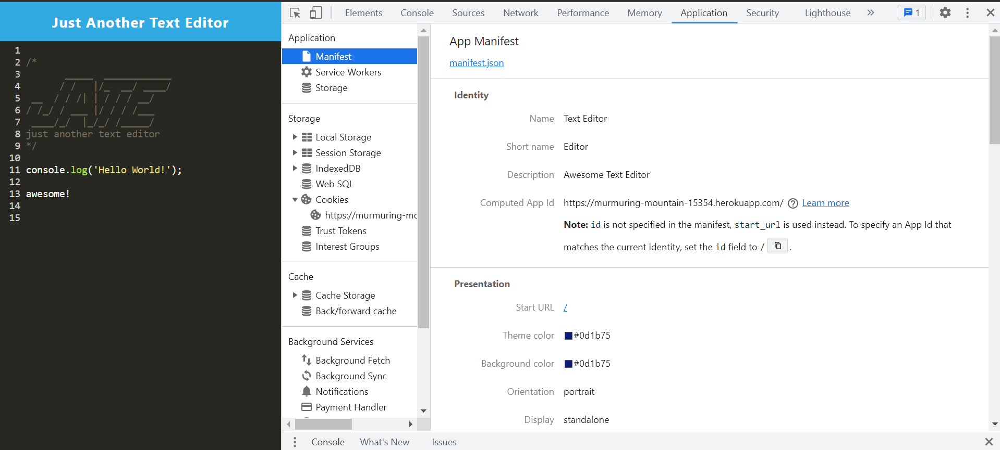
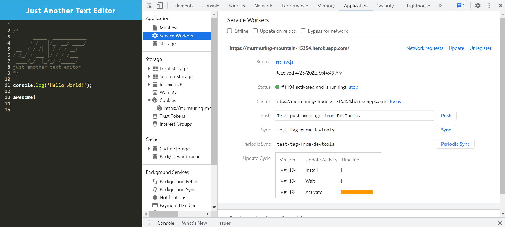
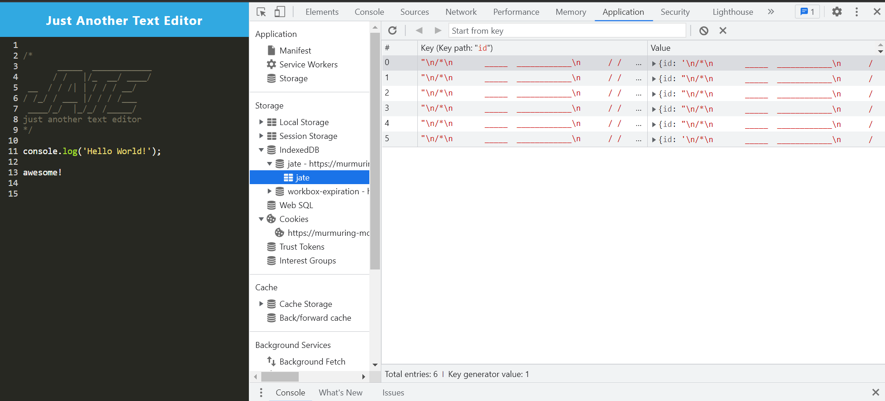

# 19-Text-Editor-IanNicholas
Just Another Text Editor

  
  
  ## Descritpion
  I text editor you can install and use offline.

  ## Table Of Contents
  [Images](#images)

  [Installation](#installation)

  [License](#license)

  [Usage](#usage)

  [Tests](#test)

  ## Images
  

  

  

  
  ## Installation

  ~~~
  Click the install button!
  ~~~

  ## License
  MIT

  ## Usage
  Just start typing your code!
  
  ## Test
  ~~~
  No tests
  ~~~

  ## Contact
  With any questions contact me at <ian.nicholas.webdeveloper@gmail.com>, for contribution efforts <https://github.com/iannicholas>